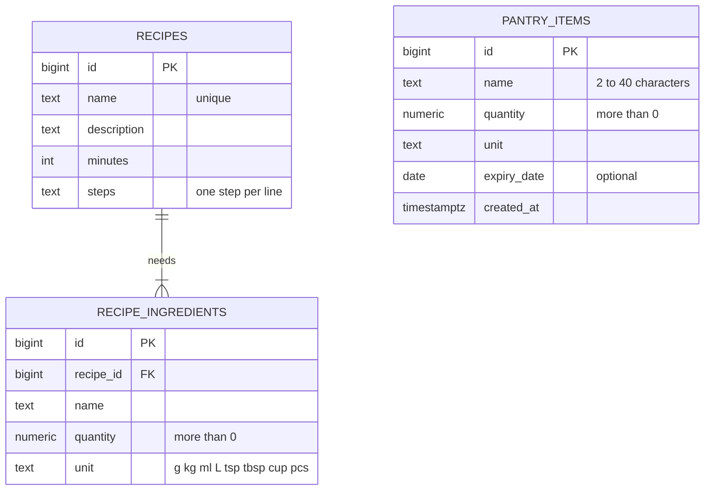

# [PantryPal] – Smart Pantry Manager

*Cook with what you already have. Waste less.*

**[PantryPal]** is an Android app, written in Java, that keeps track of the
ingredients you actually have at home and suggests recipes you can cook
**using only those ingredients**. It was built for the Mobile App Development 700
practical assignment at Richfield Graduate Institute of Technology.

## Features
Ticked as each one is finished.

- [x] **Pantry** – add, edit and delete ingredients (name, quantity, unit, optional expiry date)
- [x] **Recipe library** – 20 South African home-cooking recipes stored in the database
- [x] **Suggested Recipes** – a *strict* rule: a recipe appears only when **every**
      ingredient is in the pantry in at least the amount the recipe needs
- [x] **Smart matching** – copes with plurals (*tomato / tomatoes*), local names
      (*mielie meal / maize meal*) and units (*1 kg covers 250 g*, *2 tbsp = 30 ml*)
- [x] **Almost there** – a separate list of recipes missing exactly one ingredient
- [x] **Use it first** – warnings for food that expires soon; recipes that use it are shown first
- [ ] **Settings** – expiry alerts, warning days and the "Almost there" list can be switched on or off

## Why Supabase (PostgreSQL)?
| What the app needs | How Supabase meets it |
|---|---|
| Related data: one recipe has many ingredients | Proper PostgreSQL tables linked by a foreign key, plus CHECK rules (quantity > 0, only valid units) |
| Data must survive closing the app | Everything is stored in the cloud, so it persists after restarts and even after reinstalling |
| A simple way for the app to reach the data | Supabase generates a REST API for every table; the app sends HTTPS requests with OkHttp |
| Security | Row Level Security: the app's public key may manage pantry items but can only *read* recipes |
| Quick to set up | Free tier, a web dashboard, and one SQL script that loads all 20 recipes |

**Trade-off:** the app needs an internet connection (SQLite would work offline).
The app shows a friendly message instead of crashing when the database can't be reached.

## Data model


## Tech stack
- Java, Android Studio, minimum SDK 26 (Android 8.0)
- OkHttp 4 for web requests, org.json for JSON
- Supabase: PostgreSQL plus its auto-generated REST API
- Git and GitHub Desktop for version control

## How to run it
1. Create a free project at [supabase.com](https://supabase.com).
2. Open **SQL Editor** and run `supabase/01_schema.sql`, then `supabase/02_seed_recipes.sql`.
   Optional test data: `supabase/03_sample_pantry_optional.sql`.
3. Copy the **Project URL** and **publishable key** (Project Settings → API Keys) and add
   them to `local.properties` in the project folder:
   ```
   SUPABASE_URL=https://your-project-ref.supabase.co
   SUPABASE_KEY=your-publishable-key
   ```
4. Open the project in Android Studio, let Gradle sync, then press **Run**.

> Free Supabase projects can be paused after a period of inactivity. If the app says it
> can't reach the database, open the Supabase dashboard and restore the project.

## Development log
| Date        | Progress |
|-------------|---|
| 20 Sep 2026 | Project created; Supabase tables, access rules and 20 recipes added; first successful connection from the app |
| 21 Sep 2026 | Theme, icons and all screens added; Pantry List with RecyclerView; add, edit and delete with validation |
| 22 Sep 2026 | Strict IngredientMatcher with 12 passing unit tests; Suggested Recipes, Almost there list and Recipe Detail screens |

## Author
[Mohammed Sufiyaan Safy] · [402412276] · Richfield Graduate Institute of Technology
