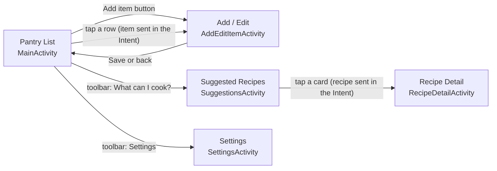
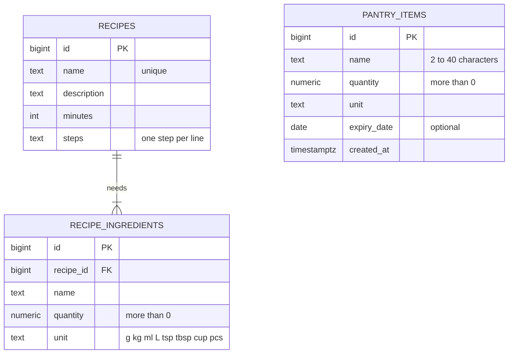

# Pantry Pal – Smart Pantry Manager

*Cook with what you already have. Waste less.*

**Pantry Pal** is an Android app, written in Java, that keeps track of the
ingredients you actually have at home and suggests recipes you can cook
**using only those ingredients**. Built for the Mobile App Development 700
practical assignment at Richfield Graduate Institute of Technology.

## Features
- [x] **Pantry** – add, edit and delete ingredients (name, quantity, unit, optional expiry date)
- [x] **Recipe library** – 20 South African home-cooking recipes stored in the database
- [x] **Suggested Recipes** – a *strict* rule: a recipe appears only when **every**
  ingredient is in the pantry in at least the amount the recipe needs
- [x] **Smart matching** – copes with plurals (*tomato / tomatoes*), local names
  (*mielie meal / maize meal*) and units (*1 kg covers 250 g*, *2 tbsp = 30 ml*)
- [x] **Almost there** – a separate list of recipes missing exactly one ingredient
- [x] **Use it first** – warnings for food that expires soon; recipes that use it come first
- [x] **Settings** – expiry warnings, how many days of warning, and the "Almost there" list

## Screens


## Data model


## How the strict rule works
`IngredientMatcher` decides what can be cooked:

1. **Clean the names.** "  Fresh Tomatoes " and "tomato" both become `tomato`;
   "Mielie meal" becomes `maize meal`. Accents, hyphens, capitals, describing words
   and plurals are all removed.
2. **Convert the amounts.** Everything becomes a base unit: grams for weight,
   millilitres for volume, pieces for things you count (1 kg = 1000 g, 2 tbsp = 30 ml).
   Weight is never compared with volume, because a cup of flour and a cup of sugar do
   not weigh the same.
3. **Add up duplicates.** "Egg 2" and "Eggs 1" in the pantry count as 3 eggs.
4. **Decide.** The recipe is suggested **only** if every ingredient is present in at
   least the required amount. Missing one, or having too little of one, keeps it out.
   Recipes missing exactly one ingredient go to a clearly separate "Almost there" list.

## Why Supabase (PostgreSQL)?
| What the app needs | How Supabase meets it |
|---|---|
| Related data: one recipe has many ingredients | PostgreSQL tables linked by a foreign key, with CHECK rules (quantity > 0, only valid units) |
| Data must survive closing the app | Stored in the cloud, so it persists after restarts and even after reinstalling |
| A simple way for the app to reach the data | Supabase generates a REST API for every table; the app uses OkHttp over HTTPS |
| Security | Row Level Security: the app's public key may manage pantry items but can only *read* recipes |
| Quick to set up | Free tier, web dashboard, and one SQL script loads all 20 recipes |

**Trade-off:** the app needs an internet connection (SQLite would work offline).
It shows a friendly message instead of crashing when the database cannot be reached.

## Tech stack
- Java, Android Studio, minimum SDK 26 (Android 8.0)
- OkHttp 4 for web requests, org.json for JSON
- Material 3 components, RecyclerView with two custom adapters
- Supabase: PostgreSQL plus its auto-generated REST API
- JUnit 4 for the matching tests

## Project structure
| File | What it does |
|---|---|
| `MainActivity` | Pantry list (home): RecyclerView, toolbar menu, delete |
| `AddEditItemActivity` | One form for adding and editing, with input validation |
| `SuggestionsActivity` | Runs the strict rule and shows both lists |
| `RecipeDetailActivity` | One recipe in full, with ✓ / ✗ per ingredient |
| `SettingsActivity` | Preferences, saved with SharedPreferences |
| `IngredientMatcher` | The strict matching rule (plain Java, unit-tested) |
| `UnitConverter` | Unit conversion and formatting |
| `SupabaseClient` | Every database call: GET, POST, PATCH, DELETE |
| `PantryAdapter`, `RecipeAdapter` | Custom RecyclerView adapters |
| `PantryItem`, `Recipe`, `RecipeIngredient` | Model classes |
| `AppPrefs` | SharedPreferences helper |
| `supabase/*.sql` | Schema, access rules and the 20 seed recipes |

## Testing
`IngredientMatcherTest` holds 12 JUnit tests covering the strict rule, including
the "four of five ingredients" case, quantities that are too small, unit conversion,
plurals and local names. Run them with:

```
gradlew test
```

or right-click the test class in Android Studio and choose Run.

## How to run it
1. Create a free project at [supabase.com](https://supabase.com).
2. In **SQL Editor**, run `supabase/01_schema.sql`, then `supabase/02_seed_recipes.sql`.
   Optional test data: `supabase/03_sample_pantry_optional.sql`.
3. Copy your **Project URL** and **publishable key** (Project Settings → API Keys) into
   `local.properties` in the project folder:
   ```
   SUPABASE_URL=https://your-project-ref.supabase.co
   SUPABASE_KEY=your-publishable-key
   ```
4. Open the project in Android Studio, let Gradle sync, then press **Run**.

> Free Supabase projects can be paused after a period of inactivity. If the app says it
> cannot reach the database, open the Supabase dashboard and restore the project.

## Development log
| Date | Progress |
|---|---|
| 20 Sep 2026 | Project created; Supabase tables, access rules and 20 recipes added; first successful connection |
| 21 Sep 2026 | Theme, icons and all screens added; Pantry List with RecyclerView; add, edit and delete with validation |
| 22 Sep 2026 | Strict IngredientMatcher with 12 passing unit tests; Suggested Recipes, Almost there and Recipe Detail screens |
| 23 Sep 2026 | Settings screen, custom app icon, rotation fix, full test pass, screenshots |

## Author
Mohammed Sufiyaan Safy · 402412276 · Richfield Graduate Institute of Technology